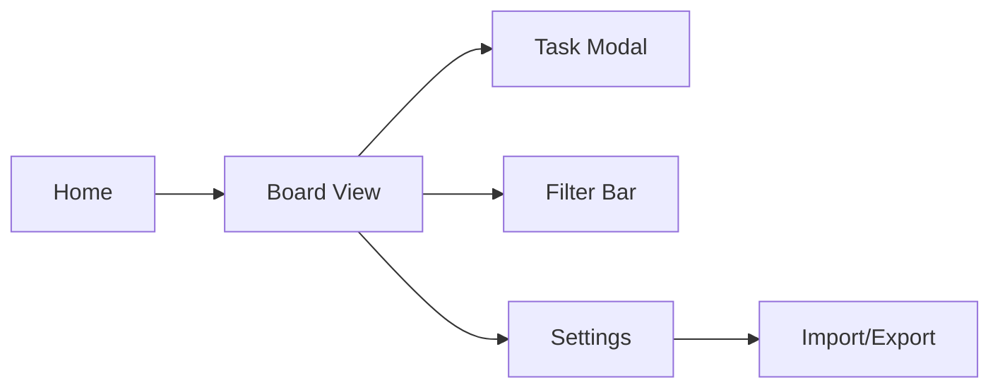

# Team-Ready Kanban Board – Press Release

**Manila, Philippines – November 6 2025** – **Team-Ready Kanban Board** launches today, giving individual project leads and productivity enthusiasts a simple, fully client-side way to manage tasks with the flexibility of a full Kanban system — all without relying on the cloud. The app helps users visualize workflows, assign labels, and track progress across multiple boards, with all data securely stored in their own browser.  

Users can customize columns, create colorful labels, and filter tasks instantly. A detailed task modal lets them capture titles, descriptions, due dates, attachments, and comments. With offline-first localStorage persistence and export/import options, Team-Ready makes it effortless to stay organized anywhere.  

“Finally, a Kanban tool that feels like Trello — but runs entirely in your browser,” said a delighted beta user.  

Team-Ready is available now as a free personal web app for browsers that support modern JavaScript and localStorage.

---

## Frequently Asked Questions  

**Q1 Who is Team-Ready Kanban Board for**  
A1 Independent professionals, students, and solo project leads who want Trello-like structure and polish without depending on any cloud service or login.  

**Q2 What problem does it solve**  
A2 Most project tools are over-engineered for teams or require online accounts. Team-Ready provides the same clarity and flow for one user who just wants control, privacy, and simplicity.  

**Q3 How does it work**  
A3 Users create boards and columns, add cards, drag them between columns, and manage tasks in rich modals. Every action auto-saves to the browser. Tasks and boards can be exported or imported as JSON for backup.  

**Q4 Key features**  
A4 • Multiple boards stored in localStorage  
• Fully customizable columns  
• Detailed task modal (description, due date, attachments, comments)  
• Custom labels with colors and label-based filtering  
• Drag-and-drop task movement  
• Dark/light mode toggle  
• JSON export/import  

**Q5 How is it different**  
A5 100 % client-side, zero login, zero setup — private, fast, and designed for solo or local use.  

**Q6 When is it available and how much does it cost**  
A6 MVP web app available now, free for personal use.  

---

# Product Requirements Document – Team-Ready Kanban Board  

## 0 Executive Summary  
A privacy-first, in-browser Kanban board for individuals who want full project management flexibility without cloud accounts or network dependency.

## 1 Narrative  
Imagine a freelance designer juggling client tasks across different projects. She’s tried Trello and Notion but finds logins, sync delays, and data exposure overkill for solo work. Then she opens **Team-Ready**, which runs instantly in her browser — no signup. She creates boards for each client, adds columns for progress stages, custom color labels, and files mockups directly into task modals. With drag-and-drop ease, she visualizes everything clearly. Even offline, her work persists. She exports her board to share snapshots with clients, confident her data never left her machine. Productivity, privacy, simplicity — all at once.

## 2 Vision & Scope  
**Vision:** Empower solo users with a fully offline, browser-native Kanban tool that feels premium but remains simple and self-contained.  
**MVP Scope:**  
• **In scope:** multiple boards, customizable columns, detailed task modals, label system with filtering, drag-and-drop, dark/light mode, JSON export/import, session-persistent filters  
• **Out of scope:** multi-user sync, real-time collaboration, notifications, mobile apps, integrations with cloud services  

## 3 Goals  

| Business | Goal statement | Success metric |
|-----------|----------------|----------------|
| Growth | Reach 500 active local users within 3 months | Browser analytics count |
| Retention | ≥70 % of users reopen the app after 7 days | localStorage session recurrence |
| Brand | Establish reputation as the simplest privacy-first Kanban | Positive feedback ratio ≥ 80 % |

| User | Goal statement | Success metric |
|------|----------------|----------------|
| Speed | Create first task in < 60 seconds | Onboarding test |
| Persistence | Data survives browser restarts | QA check |
| Clarity | Filtered board updates < 0.5 s | UX timing benchmark |

**Non-Goals**  
• No multi-device sync  
• No AI features in MVP  
• No server-side database  

These metrics prove simplicity, usability, and privacy-first value.

## 4 Personas & Key Stories  
• **Solo Project Lead** – manages personal or freelance projects privately.  
• **Student Organizer** – tracks coursework and deadlines offline.  

> “As a solo project lead, I want to manage multiple boards offline so I can keep track of work privately and efficiently.”  

> “As a student, I want to color-label tasks so I can visualize priorities at a glance.”  

## 5 Use-Case Matrix  

| ID | User Story | Acceptance Criteria |
|----|-------------|---------------------|
| UC-1 | Create a board | Board appears instantly and persists in localStorage |
| UC-2 | Add/edit/delete columns | Columns fully customizable and reorderable |
| UC-3 | Create/edit task with modal | Task modal captures title, desc, due date, labels, attachments, comments |
| UC-4 | Drag task between columns | Task updates visually and persists |
| UC-5 | Filter by label | Only tasks matching selected label visible |
| UC-6 | Toggle dark/light mode | Entire UI updates theme instantly |
| UC-7 | Export/import JSON | Boards and tasks correctly serialized/deserialized |

## 6 Functional Requirements  

### FR-1 Board Management  
1. Create, rename, delete boards  
2. Persist boards and structure in localStorage  

### FR-2 Column Management  
1. Add/edit/delete/reorder columns  
2. Save structure immediately  

### FR-3 Task Modal  
1. Fields: title, description, due date, labels (multiple), attachments (local reference or base64), comments  
2. Inline editing and autosave  

### FR-4 Labels and Filtering  
1. Create custom label names and colors  
2. Assign multiple labels per task  
3. Filter tasks by selected label(s), persist filter in session  

### FR-5 Drag-and-Drop  
1. Drag cards between columns with smooth animation  
2. Update localStorage state automatically  

### FR-6 Theme and Settings  
1. Dark/light toggle saved in localStorage  
2. Minimal design with soft accent colors  

### FR-7 Import/Export  
1. Export all boards to JSON file  
2. Import JSON to restore or merge data  

## 7 Non-Functional Requirements  
• Load time < 1 s on modern browser  
• Fully offline (no network calls)  
• Accessible via keyboard navigation  
• 99 % functional persistence across refresh  
• Secure localStorage handling (no third-party cookies)

## 8 High-Level UX Flow  

1. Home screen lists all boards with “Create Board” button  
2. Board view shows columns and tasks with drag-and-drop  
3. Task modal opens for details/editing  
4. Filter bar at top for label selection  
5. Settings menu for theme toggle and import/export  

## 9 Database Schema  

### Database 1 Boards  
| Column | Type | Description |
|---------|------|-------------|
| id | string | unique board ID |
| name | string | board name |
| columns | array | list of column objects |

### Database 2 Columns  
| Column | Type | Description |
|---------|------|-------------|
| id | string | column ID |
| name | string | column name |
| tasks | array | list of task IDs |

### Database 3 Tasks  
| Column | Type | Description |
|---------|------|-------------|
| id | string | task ID |
| title | string | task title |
| description | string | task details |
| dueDate | string | ISO date |
| labels | array | label IDs |
| attachments | array | file references |
| comments | array | comment objects |
| columnId | string | parent column reference |

### Database 4 Labels  
| Column | Type | Description |
|---------|------|-------------|
| id | string | label ID |
| name | string | label name |
| color | string | hex value |

**Linking commentary:** Boards contain columns, columns reference tasks, and tasks link to labels. All entities stored in a single JSON structure within localStorage for simplicity and export compatibility.

## 10 Build Notes  

| Priority | Feature |
|-----------|----------|
| P0 | LocalStorage data model |
| P0 | Board/column/task CRUD |
| P0 | Drag-and-drop |
| P1 | Label system & filtering |
| P1 | Theme toggle |
| P2 | Attachments/comments |
| P2 | Export/import JSON |

## 11 Out of Scope  
• Multi-user collaboration  
• Cloud sync  
• Push notifications  
• Mobile native apps  

---

### Commentary  
Strengths: strong privacy-first positioning and MVP clarity; realistic local-only scope; full-featured yet lightweight feature set. Risks: browser storage limits and potential user confusion about “team” wording — clarify that “team-ready” means team-style workflow for one user. Consider adding import/export UX early to mitigate data-loss risk. Overall, this is a well-framed, achievable MVP with excellent personal-productivity appeal.